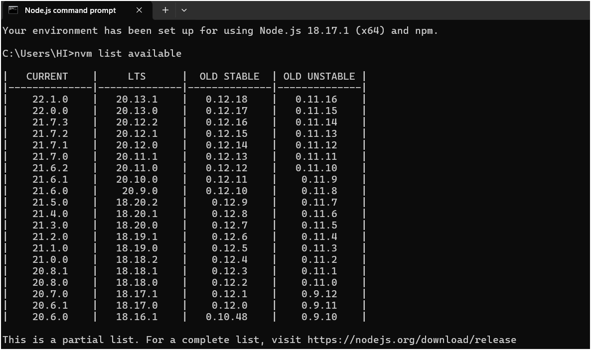

# Writing Trainer

## Setup

Make sure to install the dependencies:

```bash
# yarn
yarn install
```

or

```bash
#npm
npm install
```

## Development Server

Start the development server on `http://localhost:****`:

```bash
# yarn
yarn dev
```

or

```bash
#npm
npm run dev
```

## Production

Build the application for production:

```bash
# yarn
yarn build
```

or

```bash
#npm
npm run build
```

Locally preview production build:

```bash
# yarn
yarn preview
```

or

```bash
#npm
npm run build
```

## Setup node

` Expected version "^18.18.0 || >=20.0.0"`

If your node version is outside the required range.
Follow these steps

1. Download [nvm-setup.zip](https://github.com/coreybutler/nvm-windows/releases/download/1.1.7/nvm-setup.zip) extract and install it.
2. Execute command `nvm list available` from cmd or gitbash or powershell, this will list all available version of node.
   
3. Use command `nvm install version` e.g. `nvm install 20.0.0` to install on the machine
4. Last once installed use `nvm use version` to use newer version e.g. `nvm use 20.0.0`.
